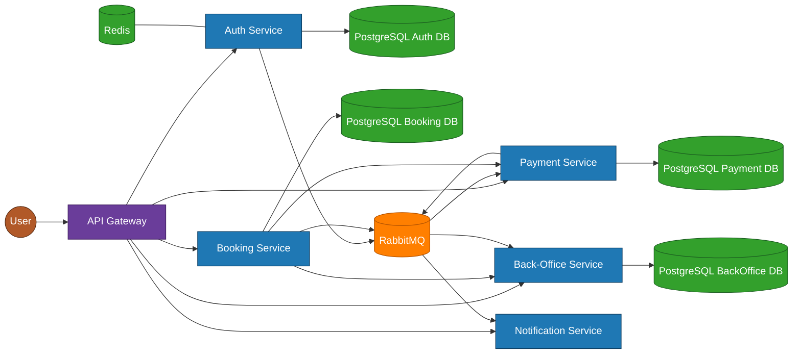

# 💻 CoworkingGrab
CoworkingGrab - микросервисная backend-система для бронирования рабочих мест в коворкингах.<br>
Платформа позволяет пользователям регистрироваться, находить доступные рабочие места и бронировать их на определённый период времени.
---
## 🛠 Технологический стек


---

## 🏛 Архитектура приложения

Система построена на основе **микросервисной архитектуры** и состоит из **API Gateway** и пяти сервисов, взаимодействующих через **брокер сообщений RabbitMQ** и **HTTP**.

#### ⚙️ Использованные архитектурные паттерны:

> 🌐 Api-Gateway (взаимодействие клиента только с одним API-шлюзом)<br>
> 📡 Event-Driven (обмен событиями через брокеры сообщений)<br>
> 🗄️ Database per Service (каждый сервис хранит свои данные в отдельной БД)<br>
> 🔄 Частичная реализация Saga Pattern для оркестрации бизнес-операций между сервисами (для полного соответствия паттерну необходима доработка компенсационных действий)<br>
> 
- 🧩 **API Gateway** — единая точка входа; маршрутизация запросов к сервисам.
- 🔐 **Auth Service** — регистрация и аутентификация пользователей; хранение пользователей в PostgreSQL, OTP кодов в Redis; **отправляет следующие события через RabbitMQ**:  
  `user.created` → Payment Service,  
  `otp.requested` → Notification Service.
- 💸 **Payment Service** — управление балансом; создаёт пользователя при `user.created`, обрабатывает платежи (Webhook ЮKassa); **отправляет событие** `payment.success` → Notification Service; предоставляет функционал для списания средств на запрос Booking Service.<br>
- ✉️ **Notification Service** — отправка уведомлений: OTP и чеки; **слушает события через RabbitMQ**: `otp.requested`, `payment.success`.
- 🏢 **Back-Office Service** — управление коворкингами и местами; создание, обновление, freeze/unfreeze коворкингов; проверка доступности; **слушает события через RabbitMQ**: `booking.started`, `booking.expired`.
- 📅 **Booking Service** — управление бронированиями; проверка доступности через Back-Office API (HTTP), синхронное списание денежных средств с баланса в Payment сервисе (RabbitMQ); **отправляет события через RabbitMQ**: `booking.started`, `booking.expired`; хранение бронирований в PostgreSQL; завершение истекших бронирований через cron-воркер.

> 🔒 В проекте реализована аутентификация и авторизация пользователей с использованием JWT токенов.<br>
> 📝 В проекте реализовано централизованное логирование сервисов: Pino (NestJS) и SLF4J (Java).<br>
> 🔗 Swagger (OpenAPI) доступен через API Gateway и описывает все публичные эндпоинты системы.<br>
---

## 🏛 Визуальная диаграмма приложения

> ⚠️ Это краткая схема, она демонстрирует основные сервисы и потоки данных. Некоторые детали (например, внутренние события) могут быть опущены.

---

## 📈 Планы по дальнейшей доработке приложения (03.03.2026)

- Реализация идемпотентности для ключевых операций для исключения непреднамеренного дублирования операций.<br>
- Обработка асинхронных событий с повторными попытками (retry) и корректным управлением неуспешными сообщениями (DLQ).<br>
- Проектирование и реализация полноценных компенсационных действий для сложных бизнес-процессов.<br>
- Исправление мелких недочетов, багов, рефакторинг кода (постоянно).<br>

---

## ⚙️ Конфигурация

Все сервисы используют `.env` файлы для настройки.  
В репозитории есть `.env.example` для каждого сервиса. Перед запуском нужно скопировать `.env.example` в `.env`.<br>
Инструкция по сборке `.env` файла находится в блоке "Запуск проекта"

> Для изменения конфигурации редактируйте `.env` соответствующего сервиса перед запуском.  
> Все сервисы подхватывают переменные из `.env` через Docker Compose.
---

## 🚀 Запуск проекта

#### 1. Клонируем репозиторий
```bash
git clone https://github.com/kiderarog/coworking-grab-microservices.git
cd coworking-grab-microservices
```
#### 2. Копируем `.env.example` в `.env` для всех сервисов
```powershell
cp apps\auth-service\.env.example apps\auth-service\.env `
& cp apps\api-gateway\.env.example apps\api-gateway\.env `
& cp apps\back-office\.env.example apps\back-office\.env `
& cp apps\booking-service\.env.example apps\booking-service\.env `
& cp apps\notification-service\.env.example apps\notification-service\.env `
& cp apps\payment-service-java\.env.example apps\payment-service-java\.env
```
#### 3. Убедиться, что Docker и Docker Compose установлены
  <li><strong>Docker:</strong> <a href="https://www.docker.com/get-started" target="_blank">https://www.docker.com/get-started</a></li>
  <li><strong>Docker Compose:</strong> <a href="https://docs.docker.com/compose/install/" target="_blank">https://docs.docker.com/compose/install/</a></li>

Если Docker или Compose не установлены, установите их перед следующими шагами.

#### 4. Запуск проекта через Docker Compose
Первоначальный билд проекта может занять 5-10 минут.
```powershell
docker compose up --build
```
---
## 📄 Документация API

В системе используется единая Swagger документация, доступная через API Gateway.<br>
API Gateway предоставляет единый Swagger UI, который описывает все публичные REST-эндпоинты системы.
- **Swagger UI:** `http://localhost:4000/docs`
- **JSON спецификация:** `http://localhost:4000/docs-json`

> Для клиента или фронтенда вся система выглядит как единое API, доступное через Gateway.  
> 
---

## 📬 Контакты

Связаться со мной:
- **GitHub:** [https://github.com/kiderarog](https://github.com/kiderarog)
- **Email:** g.valdemarych@yandex.ru
- **Telegram:** @kiderarog